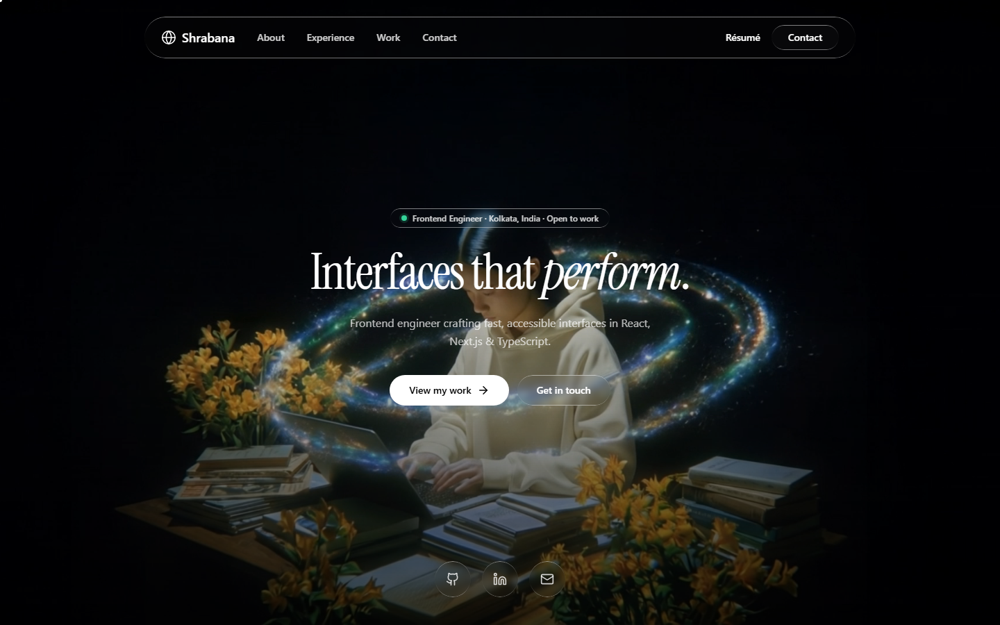
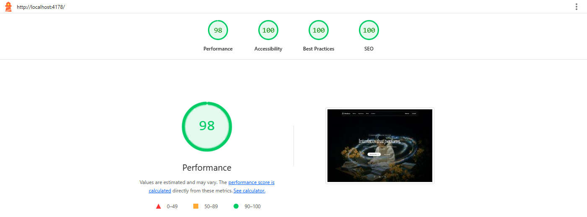

# Shrabana Goswami — Portfolio

A cinematic, single-page developer portfolio with a full-screen looping background video, liquid-glass UI, a custom themed cursor, and a dark, minimal aesthetic. Built to be fast and accessible — not just pretty.



> **Frontend Engineer · React · Next.js · TypeScript** — 4 years building responsive, accessible, high-performance web apps.

---

## ⚡ Lighthouse

Measured on the **production build** (`vite build`), desktop preset, Lighthouse 13.4.



| Performance | Accessibility | Best Practices | SEO |
| :---------: | :-----------: | :------------: | :-: |
|   **98**    |    **100**    |    **100**     | **100** |

**Core Web Vitals:** FCP `0.8s` · LCP `0.8s` · Total Blocking Time `0ms` · CLS `0.002` · Speed Index `1.0s`

The full report is checked in at [`lighthouse/lighthouse-desktop.html`](lighthouse/lighthouse-desktop.html) — open it in a browser, or reproduce with:

```bash
npm run build
npm run preview -- --port 4178
npx lighthouse http://localhost:4178/ --preset=desktop --view
```

---

## ✨ Features

- **Full-screen background video** — `object-cover`, always-on native loop, with a lightweight gradient **poster** for an instant first paint.
- **Performance-conscious video** — `preload="metadata"`, decode paused when the hero scrolls off-screen, and skipped entirely for **`prefers-reduced-motion`** and **data-saver** users (poster shown instead). The heavy clip never blocks LCP.
- **Liquid-glass UI** — frosted panels with a masked gradient rim-light (`.liquid-glass`), used across the nav, buttons, cards, and chips.
- **Custom themed cursor** — a crisp dot tracking 1:1 plus a trailing glass ring that grows over interactive elements. Auto-disabled on touch devices.
- **Fully responsive** — mobile hamburger nav, fluid type, collapsing grids.
- **Accessible** — semantic landmarks, ARIA labels, AA-contrast text, hidden-but-functional scrollbar, reduced-motion support → Lighthouse a11y **100**.
- **Content-driven** — all copy lives in one typed file, [`src/data/portfolio.ts`](src/data/portfolio.ts).

---

## 🛠 Tech Stack

- **Vite** + **React 18** + **TypeScript**
- **Tailwind CSS 3** (default config)
- **lucide-react** for icons
- Font: **Instrument Serif** (Google Fonts)

No other UI libraries.

---

## 🚀 Getting Started

```bash
# install
npm install

# start the dev server
npm run dev

# type-check + production build
npm run build

# preview the production build
npm run preview
```

---

## 📁 Structure

```
src/
├─ App.tsx                  # layout & layering (video → content → nav → cursor)
├─ index.css                # font import, liquid-glass, custom cursor, base styles
├─ data/
│  └─ portfolio.ts          # single source of truth for all content
└─ components/
   ├─ BackgroundVideo.tsx   # looping video + poster + perf behaviours
   ├─ CustomCursor.tsx      # dot + trailing glass ring
   ├─ Navbar.tsx            # fixed nav with mobile menu
   ├─ Hero.tsx              # headline, CTAs, social links
   ├─ About.tsx             # pitch, stats, skill groups
   ├─ Experience.tsx        # work timeline
   ├─ Projects.tsx          # project cards
   ├─ Contact.tsx           # closing CTA + footer
   └─ SectionHeading.tsx    # shared section header
```

---

## 📬 Contact

- **Email:** shrabanagoswami8@gmail.com
- **GitHub:** [@ShrabanaG](https://github.com/ShrabanaG)
- **LinkedIn:** [shrabana-goswami](https://www.linkedin.com/in/shrabana-goswami-363219236)
